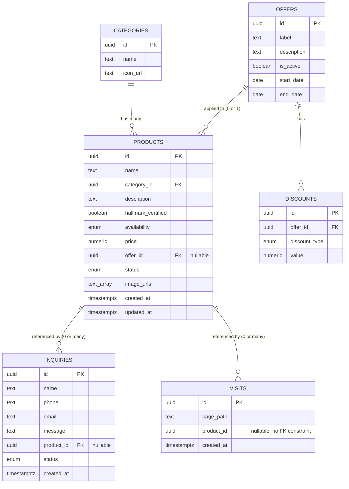

# Avirat Jewelers — Schema Diagram

## Relationship notes

- **categories → products**: one-to-many. Every product has exactly one category (single FK, not multi-category).
- **offers → products**: one-to-many, but capped at one active offer per product in practice — `products.offer_id` is nullable, a product may have zero or one offer.
- **offers → discounts**: one-to-many. A `discount_type` + `value` row is tied to a specific offer (percentage or flat amount).
- **products → inquiries**: one-to-many, nullable FK. An inquiry may or may not originate from a specific product page.
- **products → visits**: one-to-many, nullable, used for analytics tracking only — not a strict FK constraint since visit rows should still be recorded even if referencing a product loosely.

## Access summary (from PRD §5)

| Table | Public read | Public write | Admin |
|---|---|---|---|
| products | ✅ (status='published' only) | ❌ | full CRUD |
| categories | ✅ | ❌ | full CRUD |
| offers | ✅ | ❌ | full CRUD |
| discounts | ✅ | ❌ | full CRUD |
| inquiries | ❌ | ✅ (insert only) | read + status update |
| visits | ❌ | ✅ (insert only) | read only |
